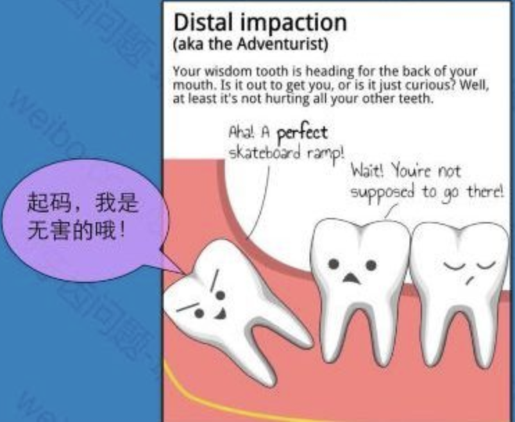

## 消失的牙齿

### 牙齿的组成
> 人类有两组牙齿。第一组称为乳牙（乳齿或奶齿），在婴儿出生后约6个月出现。儿童有20只乳齿，平均上下两排分配。每半排牙齿分别有：
- 正门牙
- 侧门牙
- 犬齿
- 第一大臼(jiu)齿
- 第二大臼齿

> 人类在4至13岁之间，将会长出一组永久性的牙齿，称为恒牙或恒齿。恒齿在乳齿底下形成，把乳齿推出颌骨后取而代之。新的一组牙齿共32只，相应长大了的颌骨加大。恒齿长出后，每半排牙齿会分别有：

- 正门牙 4
- 侧门牙 4
- 犬齿 4
- 第一小臼齿 (第一前磨牙) 4
- 第二小臼齿 (第二前磨牙) 4
- 第一大臼齿 (第一磨牙) 4
- 第二大臼齿 (第二磨牙) 4
- 第三大臼齿（智齿） 4

> 牙齿的构造

A-齿冠 B-齿根 1-珐琅质 5-白垩质 2-象牙质 6-颚骨 3-齿髓组织 7-微血管 4-牙肉 8-神经

人类牙齿的三部主要细胞组织，分别是：
- 珐琅质（又称牙釉质）－钙质和磷肥质构成的外表硬层
- 象牙质（又称牙本质）－牙齿的躯体，牙齿主要的身躯
- 牙髓－牙齿核心，包含神经线和血管

### 健康的牙齿是什么颜色？
> 健康的牙齿是明亮的白色，这个颜色来自珐琅质中的磷酸钙；牙齿的尖端和边缘看起来是半透明或天蓝色。这是完全正常的。
牙齿变黄代表珐琅质流失。珐琅质下面的象牙质是黄色的，当珐琅质磨损而暴露出象牙质时，牙齿就会失色开始泛黄。可以摄取富含钙质的食物（如牛奶、优格、杏仁和毛豆）来强化珐琅质，帮助它恢复白洁。(也可以喝含氟的水，来支持珐琅质的健康。氟化物可以增强珐琅质，防止黄色的象牙质暴露出来。)

### 智齿问题
> 智齿是指人类口腔内牙槽骨上最里面的第三颗磨牙，通常情况下应该有上下左右对称的4颗牙，有的少于4颗甚至没有，极少数人会多于4颗。萌出的年龄差异也很大，有的人20岁之前萌出，有人40、50岁才长或者终生不长。

#### 智齿与进化
> 智齿的进化有两个可能：第一，在人类从猿进化而来的过程中下颚体积变小，没有颌骨空间留给智齿；第二，可能与口腔卫生有关，古代的成年人只有几颗牙齿或大部分牙齿脱落是很平常的事，这时候刚长出来的智齿就能发挥作用。而现代口腔医学发达、营养充足，人人都有刷牙的习惯，也可以在牙齿脱落前治疗蛀牙，因此除非发生意外，否则成年人的牙齿一般都会保持完整，智齿就变成多余的了。由于没有生长空间，智齿生长时往往会有疼痛，且萌出后位置和方向会发生异常，大部分人的智齿没有咀嚼功能，没有对咬牙。也就是说，智齿一般是多余的。

#### 智齿引起的疾病
> 智齿引起的牙科疾病： A 智齿横生压迫邻牙 B 因为难以清洁导致蛀牙 C 未能完全长出的智齿因为被牙肉局部包裹，容易导致牙肉发炎 D 位于上颚或下颚的智齿如果已完全长出，但另一边对咬的智齿未能长出，已完全长出的智齿因为缺乏对咬牙的钝化而移位及变得锋利

> 智齿一定要拔除吗？
- 可以正常行使功能的智齿可以不用拔除（完全萌出，形态和位置正常，与前面的牙齿临接正常，`相对咬合的牙齿正常`,有一定的咀嚼功能）。
- 与世隔绝的牙齿可以不用拔除（如果`智齿阻生`，和外界完全隔离，没有形成`牙龈盲袋`）。

- 如果智齿形态正常，而智齿前面的第二磨牙损坏严重，需要做根管治疗甚至打桩种植牙，可以在咨询正畸科后（后期是否可以通过牵引矫正），拔除大面积破坏的第二磨牙，而保留智齿后续治疗。

### 龋齿问题
> 龋病，俗称蛀牙、虫牙，主要是牙齿上的细菌分解食物残渣引起的牙齿脱钙导致的。

### 补牙

### 根管治疗

### 种植牙

### 如何预防龋齿
- 儿童参加窝沟封闭和涂氟，尤其是6岁左右六龄齿萌出之后去做窝沟封闭；
- 成人使用含氟牙膏，正确刷牙，配合牙线；
- 定期看牙医。

### 如何正确刷牙
>  刷后牙颊舌面方法：刷毛与牙面呈45º角，2~3颗牙为一组，短距离水平颤动数次然后将牙刷向冠方转动；刷前牙舌面方法：将刷头竖放在牙面上，使前部刷毛接触龈缘，自上而下拂刷。

<video src="./1573526099171964.mp4">