## unicorn内存优化分析

### 背景介绍：
分析师制图：分析师在制作复杂，多图表多数据适合，反复进出仪表盘编辑页面易卡顿，甚至浏览器奔溃。

运营和开发使用：用户在较大的仪表盘页面切换时候感觉电脑越来越卡，cpu占用高，风扇声响电脑发热。


### 2019年优化点：
1、图表超过400数据点自动去拐点
2、超过1500点默认不显示图表
3、关闭echart图表动画效果

### 现存问题和问题分析

> 现存问题：用户长时间使用unicorn（不刷新），会感觉交互会慢慢变卡。

> 问题分析：最大的原因是项目中存在echarts实例引起的内存泄露，其次还有一些dom、事件监听没有释放。


### 借助Chrome Dev Tools验证下
1、在`unicorn`下面里面制做两个相同的仪表盘，制定一个`Benchmark`，共`14`个echart面积图，每个图表`378`个数据点，且显示所有数据点。
2、为了避免装给浏览器装的一些插件造成影响，使用`Chrome`的隐身模式页面，它会把所有的插件都给禁掉。
3、打开本地启动的`Unicorn`项目对应的Benchmark的仪表盘-验证图表性能，打开`Chorme`控制台右上角的更多里面的More tools的`Performance monitor`,这个面板可以看到CPU usage,JS heap size等实时指标。
4、从验证图表性能仪表盘，点击跳转到验证图表性能1仪表盘，观察CPU usage,JS heap size等指标变化情况。

> 优化前

第一次加载完后10s:

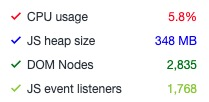

第二次加载完后10s：

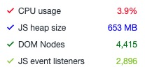


第三次加载完后10s：

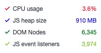

> echart实例占用的js堆内存等，不能在仪表盘切换后释放，造成内存泄漏


### 什么是内存泄露
参考XXXXX

### 用Memory的Heap snapshot来定位问题

> heap snapshot(堆快照)，给当前内存堆拍一张照片。因为动态申请的内存都是在堆里面的，而局部变量是在内存栈里面，是由操作系统分配管理的是不会内存泄露了。所以关心堆的情况就好了。

> 操作流程
- 在`unicorn`下面里面制做两个相同的仪表盘（两个柱状图1，两个柱状图2）。
- 打开两个柱状图1仪表盘，然后点击拍照按钮。
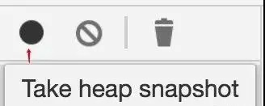

它就会把当前页面的内存堆扫描一遍显示出来，如下图所示：
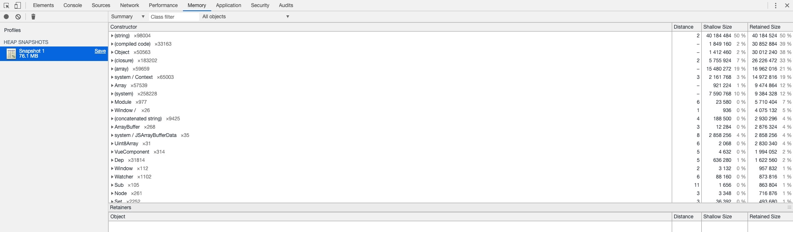

- 打开两个柱状图2仪表盘，点击垃圾回收的按钮,避免其他干扰问题，然后点击拍照按钮。

它就会把当前页面的内存堆扫描一遍显示出来，如下图所示：
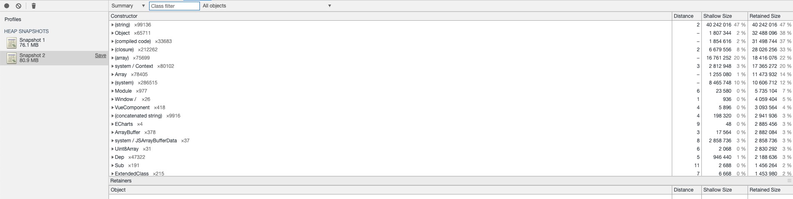

> 排查下echart相关的泄露问题
在Class Filter的搜索框里搜一下echart：
第一次快照
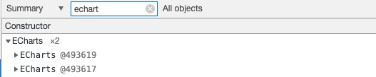

第二次快照
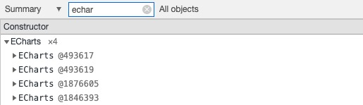

确认存在echart引用导致的内存泄露，定位到echart初始化的文件Echart.vue

```javascript
data () {
    return {
        chart: null
    }
}

// 初始化echart
this.chart = echarts.init(this.$refs.chart, this.theme, { devicePixelRatio });


// 组件销毁前
beforeDestroy () {
    if (this.chart) {
        this.chart.dispose()
    }
},
```

> 上面的代码存在两个问题

1、chart是data属性，Vue 将会递归将 data 的属性转换为 getter/setter，从而让 data 的属性能够响应数据变化。chart实例是个很复杂的对象会很消耗内存和性能。
2、this.chart没有手动销毁，会导致echart实例无法销毁。

> 代码调整到如下
```javascript
created () {
    // created生命周期赋值，这样chart实例不会被vue进行依赖收集
   this.chart = null
},

// 初始化echart
this.chart = echarts.init(this.$refs.chart, this.theme, { devicePixelRatio });


// 组件销毁前
beforeDestroy () {
    if (this.chart) {
        this.chart.dispose()
        // 手动销毁
        this.chart = null
    }
},
```

> 验证下echart内存相关优化后的表现
第一次加载完后10s:

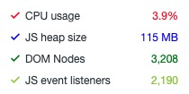

第二次加载完后10s：

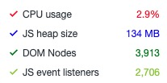


第三次加载完后10s：

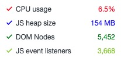

### 总结
| 优化阶段 | JS heap size | DOM Nodes | JS event listeners |
| :---         | :---:    | ---:          | :-----------  |
| 优化前      | 348MB-653MB-910MB   | 2835-4415-6345       | 1768-2896-6345          |
| 第一次优化后       | 115MB-134MB-154MB   | 3208-3913-5452     | 2190-2706-3668   |


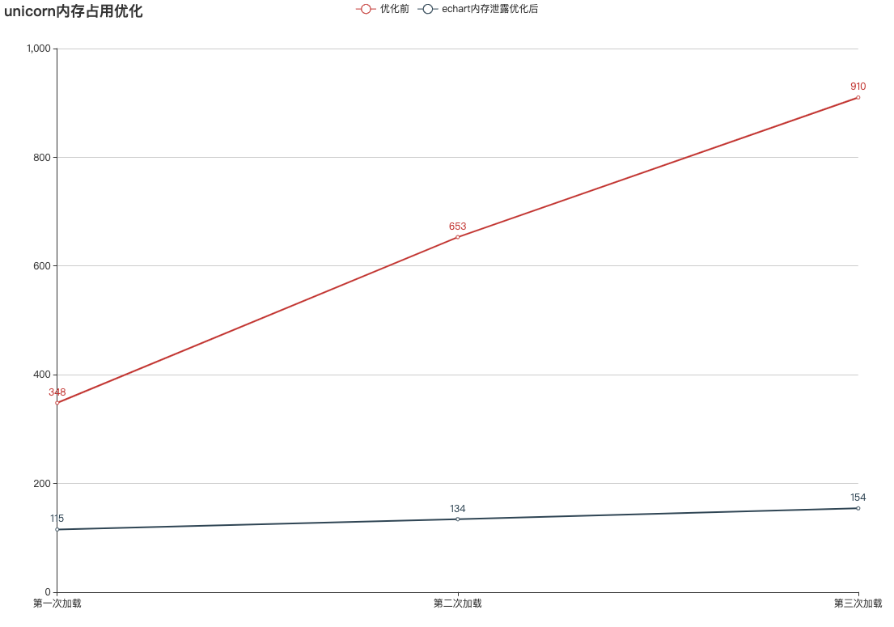

1、单个仪表盘的内存占用降低到了原来的30%
2、每次切换仪表盘，内存涨幅从原来的300左右降到了20。

### 后续优化
1、detached的dom没有被回收的问题。
2、排查下是否有event listener没有被及时回收。
3、是否还有不必要的vue data属性存在。
<!-- option = {
    title: {
        text: 'unicorn内存占用优化'
    },
    tooltip: {
        trigger: 'axis'
    },
    legend: {
        data: ['优化前', 'echart内存泄露优化后']
    },
    grid: {
        left: '3%',
        right: '4%',
        bottom: '3%',
        containLabel: true
    },
    toolbox: {
        feature: {
            saveAsImage: {}
        }
    },
    xAxis: {
        type: 'category',
        boundaryGap: false,
        data: ['第一次加载', '第二次加载', '第三次加载']
    },
    yAxis: {
        type: 'value'
    },
    series: [
        {
            name: '优化前',
            type: 'line',
            itemStyle : { normal: {label : {show: true}}},
            data: [348, 653, 910]
        },
        {
            name: 'echart内存泄露优化后',
            type: 'line',
            itemStyle : { normal: {label : {show: true}}},
            data: [115, 134, 154]
        },
    ]
};
 -->