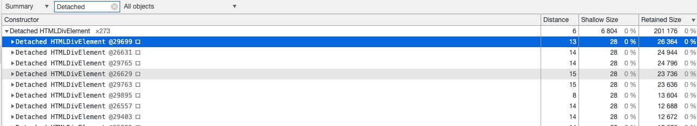
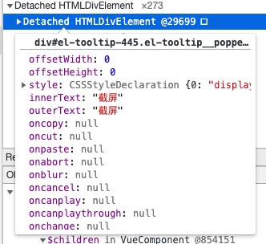
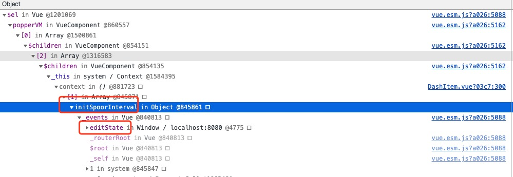
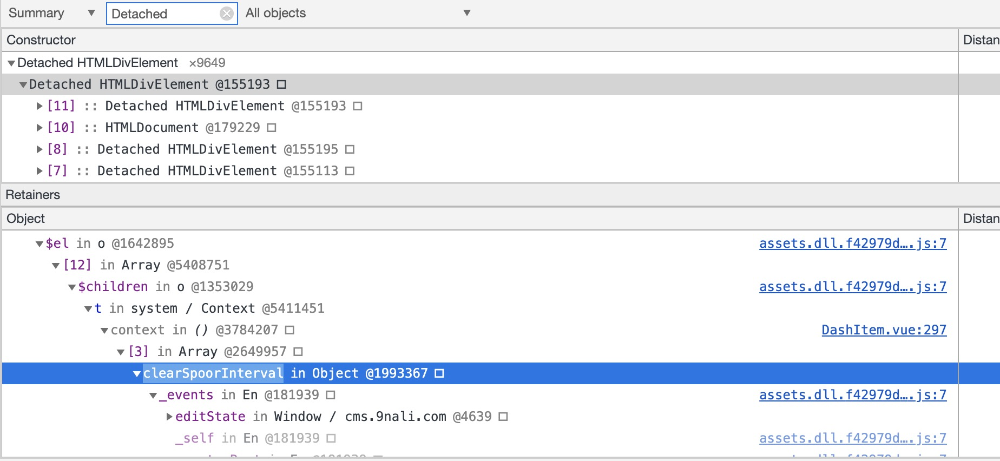
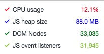
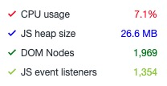

## unicorn内存优化分析2

### 本次优化点
1、detached的dom没有被回收的问题

2、排查下是否有event listener没有被及时回收

### 用Memory的Heap snapshot来定位问题

操作流程和前文一致，在内存堆扫描详情面板中的Class Filter搜索框里搜一下detached:



它会显示所有已经分离的DOM结点，我们把鼠标放上去等个2s，它就会显示这个div的DOM信息：



通过className等信息可以知道它是检查页面中的DOM节点，点击一个DOM节点，在下面的Object的窗口查看详细信息：



从截图中可以看出DashItem.vue文件中，存在一个initSpoorInterval，下面查看具体代码：

```javascript
// 用eventBus注册了initSpoorInterval，忘记了解绑
mounted () {
    editState.$on('initSpoorInterval', () => {
        this.setSpoorInterval('init')
    })
},
```

再看下其他的分类的节点的情况：


```javascript
// 用eventBus注册了clearSpoorInterval，忘记了解绑
mounted () {
    editState.$on('clearSpoorInterval', () => {
        this.setSpoorInterval('clear')
    })
},
```

### 解决

> 针对这一类似的问题，需要寻找一个一劳永逸的解决方案，如果只是找到一处改一处，后面可能还会出现这种疏漏。

目前存在两个问题会对性能有造成影响

1、用editState这种eventBus注册的事件，再组件销毁前需要手动销毁。

2、必须新建一个全局变量来存放eventBus。

新建一个中间件文件event.js

```javascript
import Vue from 'vue'
export const event = new Vue()
const eventCache = new WeakMap()
const initedEventCache = new WeakMap()

export default {
  install(_Vue) {
    _Vue.prototype.$initEvent = function initEvent() {
      if (initedEventCache.get(this)) {
        return initedEventCache.get(this)
      }
      const sets = new Set()
      eventCache.set(this, sets)
      const componentEvent = {
        $on(name, handle) {
          sets.add(name)
          event.$on(name, handle)
          return this
        },
        $off: event.$off,
        $emit(name, params) {
          event.$emit(name, params)
          return this
        }
      }
      initedEventCache.set(this, componentEvent)
      return componentEvent
    }
    _Vue.mixin({
      beforeDestroy() {
        (eventCache.get(this) || []).forEach(eventName => {
          event.$off(eventName)
        })
      }
    })
    _Vue.event = _Vue
  }
}

```

### 优点及使用方法

1、没有必要在window上新建个全局对象来存放EventBus。
2、不用关心事件是否解绑。
3、为了避免疏忽导致的遗忘，使用WeakMap结构，它们对于值的引用都是不计入垃圾回收机制的。

引用main.js
```javascript
import event from './event'
// 全局注册
Vue.use(event)
```

使用
```javascript
// 绑定
this.$initEvent().$on('filterInputChange', this.inputChange)

// 触发
this.$initEvent().$emit('filterInputChange')
```

### 分别访问6个相同仪表盘，对比下优化前后的差异

线上环境-优化前




预发环境-优化后



DOM Nodes、JS event listeners、JS heap size下降明显。


### 总结
| 优化阶段 | JS heap size | DOM Nodes | JS event listeners |
| :---         | :---:    | ---:          | :-----------  |
| 线上Benchmark      | 281MB-296MB-312MB   | 6306-3815-5374       | 4181-2624-3563          |
| 预发环境Benchmark      | 60.5MB-60.9MB-66.6MB   | 2315-2297-2333     | 1728-1739-1806   |

unicorn经过两次性能优化，内存方面已经相对比较稳定了。切换仪表盘之前销毁的组件内存几乎能够完全释放掉。

### 后续还会优化

1、editState相关属性移动到vuex，相关的eventBus切换到event.js方式。
2、仪表盘编辑页面的内存优化。
3、左侧菜单树瘦身