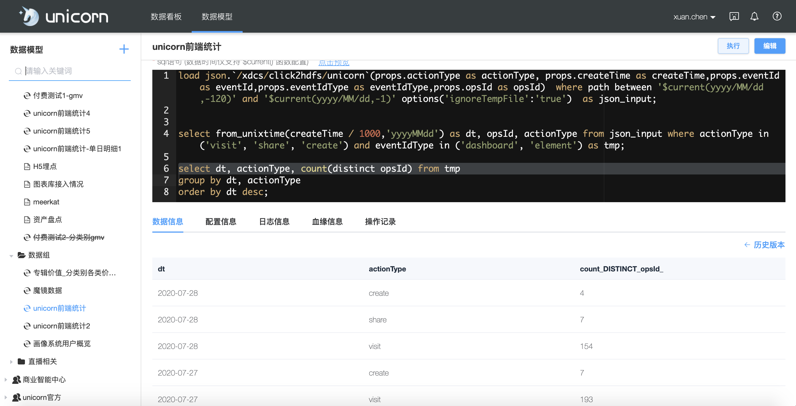
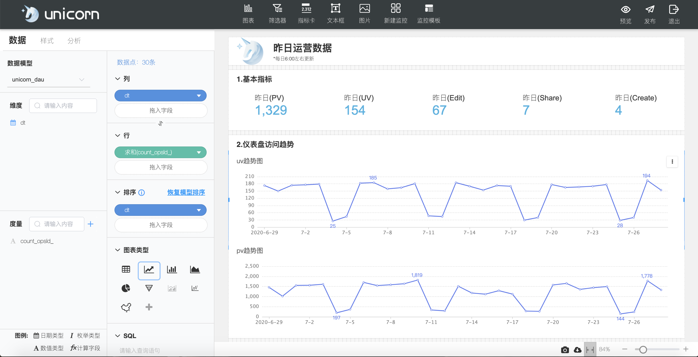
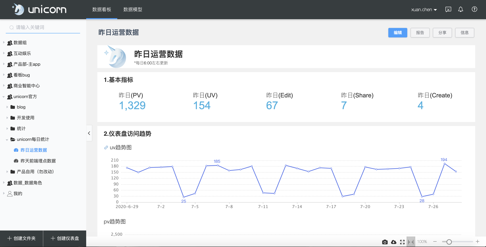

## 前言

首先我会介绍一下我们公司内部的`数据可视化平台` —— `Unicorn`，让大家了解下unicorn目前有哪些功能。

本次的主要议题 —— `如何快速定位性能问题`，在这部分我将向大家着重介绍一些我们产品迭代中的一些问题和优化手段。

## 产品介绍

### 业务背景
首先先来说一下为什么我们要做这样一个数据可视化平台，主要有以下几个方面：

| 产品 | 是否免费 | Ops账号登录、细分权限  | 易上手 | 公司计算引擎集成 |
| :--- |    :----:   |    :---: |     ---: |     :---: |
| Tableau |  ❌  |  ❌  |  ✅  |  ❌  |
| 网易有数 | ❌ | ❌ | ✅ |  ❌  |
| Excel | ❌ | ❌ | ✅ |  ❌  |
| Unicorn | ✅|  ✅ | ✅ |  ✅ |

由于有上面这些业务场景，我们便开始搭建属于喜马拉雅的一个数据可视化平台。

### 产品功能效果图

简单展示一下unicorn的实际效果图

首先是`数据模型`界面，进入“数据模型”模块，可以创建数据模型，包括静态数据模型&动态数据模型&CSV数据模型，其中动态数据模型支持占位符的配置：

配置好数据模型的`sql语句`和`配置信息`，点击执行按钮成功后，就可以到仪表盘的编辑界面使用做好的数据模型制作仪表盘。

用户可以根据需求，添加自己所需要的图表、筛选器、指标卡、文本、监控等，
用户再图表编辑面板上选择数据模型，调整图表样式配置。

## 如何快速定位性能问题

### unicorn迭代中遇到的问题

1、用户长时间使用unicorn，会感觉交互会慢慢变卡

2、数据模型页面加载和退出会卡顿3s以上

### 调试定位问题
1、在`unicorn`下面里面制做两个相同的仪表盘，制定一个`Benchmark`，共`14`个echart面积图，每个图表`378`个数据点，且显示所有数据点。

2、为了避免装给浏览器装的一些插件造成影响，使用`Chrome`的隐身模式页面，它会把所有的插件都给禁掉。

3、打开本地启动的`Unicorn`项目对应的Benchmark的仪表盘-验证图表性能，打开`Chorme`控制台右上角的更多里面的More tools的`Performance monitor`,这个面板可以看到CPU usage,JS heap size等实时指标。

4、从验证图表性能仪表盘，点击跳转到验证图表性能1仪表盘，观察CPU usage,JS heap size等指标变化情况。

### 性能问题原因猜想

> 根据上一步