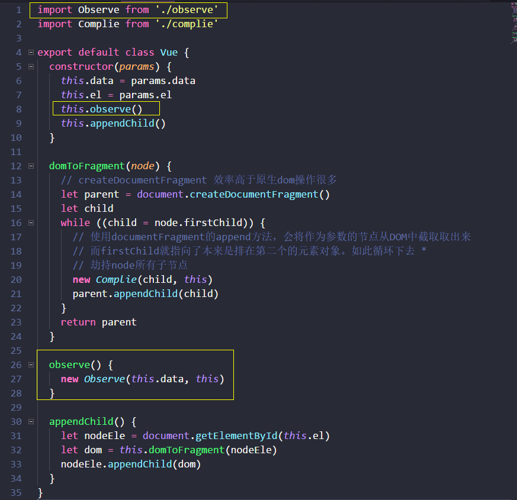
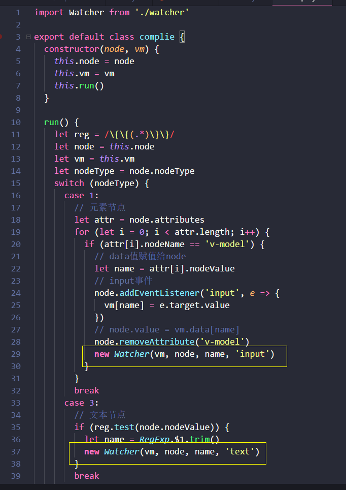
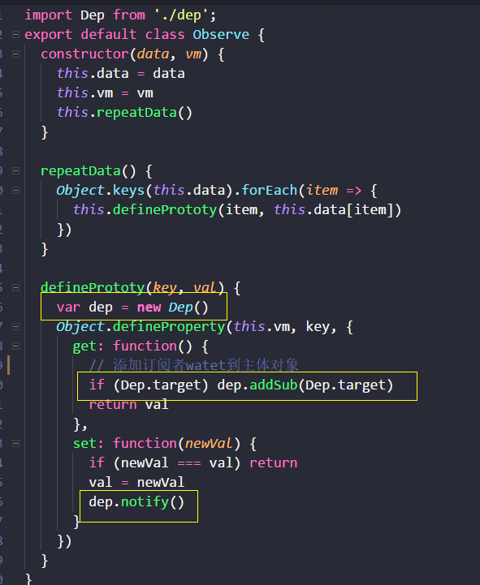

# 🐼 Vue 简单双向数据绑定demo原理解析

## 目标
> 实现如下的双向绑定
```html
<div id="app">
    <input type="text" v-model="text1">
    {{text1}}
     <input type="text" v-model="text2">
    {{text2}}
</div>
```
```javascript
new Vue({
  el: 'app',
  data: {
    text1: 'chenxuan',
    text2: 'chenxuan1'
  }
})
```
## [🔰原生js源码](./demo1.js)

## ⛷技术点
> 不熟悉自行点链接了解(不做详细解释)

- [**`Es6-class`**](http://es6.ruanyifeng.com/#docs/class)

- [**`DocumentFragment`**](https://developer.mozilla.org/zh-CN/docs/Web/API/DocumentFragment)

- [**`Object.defineProperty`**](https://developer.mozilla.org/zh-CN/docs/Web/JavaScript/Reference/Global_Objects/Object/defineProperty)

- [**`订阅/发布模式`**]


## 📢订阅/发布模式（subscribe&publish）

> 订阅发布模式（又称观察者模式）定义了一种一对多的关系，让多个观察者同时监听某一个主体对象，这个主体对象的状态发生改变时就会通知所有观察者对象。

> 发布者发出通知 => 主题对象收到通知并推送给订阅者 => 订阅者执行相应操作


- **⌨ a simple example**
```javascript
// 发布者函数
var publish = {
  pub: function () {
    dep.notify()
  }
}

// 两个订阅者
var sub1 = { update: function () {console.log(1)}}
var sub2 = { update: function () {console.log(2)}}

// 主体对象
function Dep () {
  this.subs = [sub1 , sub2]
}
Dep.prototype.notify = function () {
  this.subs.forEach(function (sub) {
    sub.update()
  })
}

// 发布者发布消息,主体对象执行notify,进而触发订阅者的update
var dep = new Dep()
publish.pub() // 1 , 2
```


## ⤵实现步骤细化
*1、* 输入框以及文本节点与 data 中的数据绑定。

*2、* 输入框内容变化时，data 中的数据同步变化。即 view => model 的变化。

*3、* data 中的数据变化时，文本节点的内容同步变化。即 model => view 的变化。


### ⌛ 步骤1: data和输入框文本框数据绑定

> [**入口index.js**](./es6/index.js)

```javascript
import Vue from './vue'

new Vue({
  el: 'app',
  data: {
    text1: 'chenxuan',
    text2: 'chenxuan1'
  }
})
```

> *DocumentFragment*（文档片段）可以看作节点容器，它可以包含多个子节点，当我们将它插入到 *DOM* 中时，只有它的子节点会插入目标节点，所以把它看作一组节点的容器。使用 *DocumentFragment* 处理节点，速度和性能远远优于直接操作 *DOM*。*Vue* 进行编译时，就是将挂载目标的所有子节点劫持（通过 *append* 方法，*DOM* 中的节点会被自动删除）到 *DocumentFragment* 中，经过一番处理后，再将 *DocumentFragment* 整体返回插入挂载目标。

> [**vue.js**](./es6/vue.js)

```javascript
import Complie from './complie'

export default class Vue {
  constructor (params) {
    this.data = params.data
    this.el = params.el
    this.appendChild()
  }

  domToFragment (node) {
    // createDocumentFragment 效率高于原生dom操作很多
    let parent = document.createDocumentFragment()
    let child
    while ((child = node.firstChild)) {
      // 使用documentFragment的append方法，会将作为参数的节点从DOM中截取取出来
      // 而firstChild就指向了本来是排在第二个的元素对象。如此循环下去 
      // 劫持node所有子节点
      new Complie(child, this)
      parent.appendChild(child)
		}
    return parent
  }

  appendChild () {
    let nodeEle = document.getElementById(this.el)
    let dom = this.domToFragment(nodeEle)
    nodeEle.appendChild(dom)
  }
}
```

> [**complie.js**](./es6/complie.js)

```javascript
import Watcher from './watcher'

export default class complie {
  constructor (node, vm) {
    this.node = node
    this.vm = vm
    this.run()
  }
  
  run () {
    let reg = /\{\{(.*)\}\}/
    let node = this.node
    let vm = this.vm
    let nodeType = node.nodeType
    switch (nodeType) {
      case 1:
        // 元素节点
        let attr = node.attributes
        for (let i = 0; i < attr.length; i++) {
          if (attr[i].nodeName == 'v-model') {
            // data值赋值给node
            let name = attr[i].nodeValue
            // input事件
            node.addEventListener('input', e => {
              vm[name] = e.target.value
            })
            // 渲染元素节点值
            node.value = vm.data[name]
            node.removeAttribute('v-model')
          }
        }
        break
      case 3:
        // 文本节点
        if (reg.test(node.nodeValue)) {
          let name = RegExp.$1.trim()
          // 渲染文本节点值
          node.nodeValue = vm.data[name]
        }
        break
      default:
        break
    }
  }
}
```


### ⌛ 步骤2: 响应式的data绑定 view => model
> 当我们在输入框输入的时候，会触发 *input* 事件，在相应的事件处理回调中，我们获取输入框的 *value* 并赋值给 *Vue* 实例的 *data* 对应的属性。这里会用 *defineProperty* 将 data 中的 各个属性 设置为实例的访问器属性(优先级高于普通属性)，因此给对应属性赋值，就会触发 *set* 方法。在 set 方法中主要做两件事 ,第一是更新属性的值,第二是同步值到页面(步骤三实现)

> 1. 增加observe

<p align="center">
    
</p> 

> *Object.defineProperty* 将 data 中的 各个属性 设置为实例的访问器属性(优先级高于普通属性)

> 2. [**observe.js**](./es6/observe.js)

```javascript
export default class Observe {
  constructor (data, vm) {
    this.data = data
    this.vm = vm
    this.repeatData()
  }
  
  repeatData () {
    Object.keys(this.data).forEach(item => {
      this.definePrototy(item, this.data[item])
    })
  }
  
  definePrototy (key, val) {
    Object.defineProperty(this.vm, key, {
      get: function () {
        return val
      },
      set: function (newVal) {
        if (newVal === val) return
        // 实现更新val
        val = newVal
      }
    })
  }
}

```


### ⌛ 步骤3: 实现双向绑定 model => view

#### 回顾之前的操作
>  *new Vue()* 主要操作 监听数据: *observe()*/编译 *HTML：domToFragment()*。
> 监听数据时候为 *data* 的每个属性生成一个 dep 主体对象
> 编译 *HTML* 的过程中，会为每个与数据绑定相关的节点生成一个订阅者 *watcher*，*watcher* 会将自己添加到相应属性的 *dep* 中。
> 目前已经实现：修改input => 在事件回调函数中修改属性值 => 通过 *definePrototype* 触发属性的 *set* 方法。
> 下面要实现: 发出通知 *dep.notify()* => 触发订阅者的 *update* 方法 => 更新视图。
> *important* 如何将 *watcher* 添加到关联属性的 *dep* 中 ?

> 1. 在编译 HTML 过程中，为每个与 data 关联的节点生成一个 Watcher

<p align="center">
    
</p> 

> 2. [**watcher.js**](./es6/watcher.js)

> 2.1 把自己赋值给了一个全局变量 Dep.target

> 2.2 执行了 update 方法，进而执行了 get 方法，get方法读取实例的访问器属性，从而触发了访问器属性的 get 方法，get 方法中将该 watcher 添加到了对应访问器属性的 dep 中

> 2.3 获取属性的值，然后更新视图

> 2.4  Dep.target 设为空。因为它是全局变量，也是 watcher 与 dep 关联的唯一桥梁，任何时刻都必须保证 Dep.target 只有一个值


```javascript
import Dep from './dep'
export default class watcher {
  constructor (vm, node, name, nodeType) {
    Dep.target = this
    this.name = name
    this.node = node
    this.vm = vm
    this.nodeType = nodeType
    this.update()
    Dep.target = null
  }
  
  update () {
    this.get()
    if (this.nodeType == 'text') {
      this.node.nodeValue = this.value
    } else if (this.nodeType == 'input') {
      this.node.value = this.value
    }
  }
  
  get () {
    this.value = this.vm[this.name] // 触发对应属性的get
  }
}
```

> 3. [**observe.js**](./es6/observe.js)

<p align="center">
    
</p> 

> 4. [**dep.js**](./es6/dep.js)

```javascript
export default class Dep {
  constructor () {
    this.subs = []
  }
  
  addSub (sub) {
    this.subs.push(sub)
  }
  
  notify () {
    this.subs.forEach(sub => {
      sub.update()
    })
  }
}
```