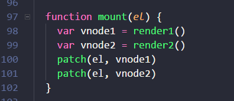
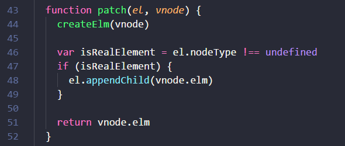
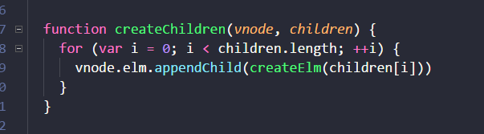

# 🐼 Vue 简单的virtual dom to real dom

## 🍄目标
> 实现从虚拟dom到真实dom的转换

## [🔰原生js源码](./index.js)

## 🖥描述
> 每一个 DOM 节点都是一个 node 对象，里面含有大量的属性与方法，虚拟 DOM 其实就是轻量版的 node 对象。

>随后会通过 createElm 方法和 createChildren 方法的相互调用，遍历整棵虚拟节点树，生成真实的 DOM 节点树，最后append到挂载点。

### ⏲1.vnode/render/mount

> 1.1 vnode实例函数

    

 

> 1.2 render

    

 

> 1.3 mount

    

 

### ⏲2.patch/createElm/createChildren

> 2.1 patch

    

 

> 2.2 createElm

    

 

> 2.3 createChildren

    

 